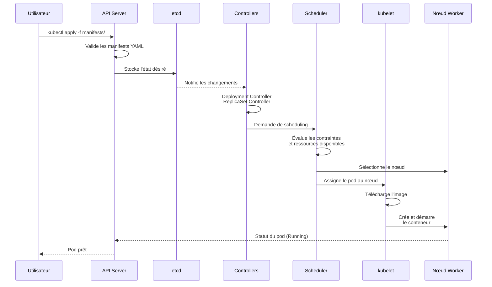

# TP1 — Comprendre, tester, ajuster (Kubernetes)

## Partie A — Compréhension & exploration

### Q1. Scheduling (4–6 lignes)
Quand on exécute `kubectl apply`, voici la chaîne de traitement dans Kubernetes :

1. **API Server** : Reçoit la requête et valide les manifests YAML
2. **etcd** : Stocke l'état désiré des ressources (deployments, services, etc.)
3. **Controllers** : Les contrôleurs (Deployment Controller, ReplicaSet Controller) détectent les changements dans etcd
4. **Scheduler** : Sélectionne un nœud approprié pour chaque pod en fonction des contraintes et ressources
5. **kubelet** : Sur le nœud sélectionné, le kubelet crée et démarre les conteneurs via le runtime (Docker/containerd)

Le processus est asynchrone et les contrôleurs surveillent en permanence l'état actuel vs l'état désiré.

#### Schéma du processus de scheduling :



### Q2. Service/Endpoints
Un **Service ClusterIP** associe ses backends via le mécanisme de **labels/selectors** :

- Le Service définit un `selector` (ex: `app: api`) qui correspond aux `labels` des pods
- Kubernetes crée automatiquement des objets **Endpoints** (ou **EndpointSlice** en v1.21+) qui listent les IPs des pods correspondants
- Quand un pod fait une requête vers le Service, kube-proxy intercepte et redirige vers une IP de pod valide
- Le load balancing se fait au niveau du kube-proxy (round-robin par défaut)

### Q3. Probes
**Readiness Probe** : Détermine si le pod est prêt à recevoir du trafic. Si échec, le pod est retiré des endpoints du service.

**Liveness Probe** : Détermine si le conteneur est vivant. Si échec, le conteneur est redémarré.

**Exemple de paramètres adaptés** :
- `periodSeconds: 10` (vérification toutes les 10s)
- `timeoutSeconds: 2` (timeout de 2s par vérification)
- `failureThreshold: 3` (3 échecs consécutifs = problème)
- `successThreshold: 1` (1 succès = OK)

### Q4. DNS interne
`http://api:80/` fonctionne sans IP grâce au **DNS interne de Kubernetes** :

- Chaque Service reçoit un nom DNS dans le cluster
- Le FQDN complet est : `api.demo.svc.cluster.local`
- La résolution se fait via CoreDNS qui interroge l'API Server
- Le format est : `<service>.<namespace>.svc.cluster.local`
- Les suffixes `.svc.cluster.local` peuvent être omis dans le même namespace

### Q5. NodePort
**Atouts en local** :
- Accès direct depuis l'extérieur sans configuration complexe
- Idéal pour le développement et les tests
- Pas besoin d'Ingress Controller

**Limites en production face à Ingress** :
- Un port par service (limitation 30000-32767)
- Pas de routage basé sur l'URL ou l'hostname
- Pas de SSL/TLS automatique
- Pas de load balancing avancé
- Gestion manuelle des certificats

## Partie B — Modification légère

### Choix : Ajout de ressources (requests/limits) à l'API

J'ai choisi d'ajouter des **resources requests et limits** au déploiement API pour les raisons suivantes :

1. **Stabilité** : Évite qu'un pod consomme trop de ressources et affecte les autres
2. **Planification** : Le scheduler peut mieux placer les pods selon les ressources disponibles
3. **Qualité de service** : Garantit des performances minimales avec les requests
4. **Production** : Pratique essentielle en environnement de production

### Justification des valeurs choisies :
- **Memory request: 64Mi** : Minimum pour faire fonctionner l'echo-server
- **Memory limit: 128Mi** : Plafond raisonnable pour éviter les fuites mémoire
- **CPU request: 50m** : 0.05 CPU core, suffisant pour un service simple
- **CPU limit: 100m** : 0.1 CPU core, limite la consommation CPU

## Captures d'écran et commandes

### 1. État initial du déploiement
**Capture :** `screens/État du déploiement.png`
```bash
kubectl get deploy,rs,pods,svc -n demo -o wide
```

### 2. Vue k9s (interface graphique)
**Capture :** `screens/Vue k9s.png`
```bash
k9s -n demo
```

### 3. Page Front (navigateur)
**Capture :** `screens/Welcome to Nginx.png`
```bash
kubectl -n demo port-forward svc/front 8084:80
# Puis accès via http://localhost:8084
```

### 4. Test de l'API via DNS interne
**Capture :** `screens/Test API via DNS interne.png`
```bash
kubectl -n demo exec deploy/front -- wget -qO- http://api:80/
```

### 5. État après modification (ressources)
**Capture :** `screens/État après modification.png`
```bash
kubectl get pods -n demo -o wide
```

### 6. Détails du pod avec ressources appliquées
**Capture :** `screens/Détails du pod avec ressources.png`
```bash
kubectl -n demo describe pod api-664f7967c9-59t2s
```

### 7. Rollout status après modification
**Capture :** `screens/Rollout status.png`
```bash
kubectl -n demo rollout status deploy/api
```

### 8. Services et ports
**Capture :** `screens/Services et ports.png`
```bash
kubectl -n demo get services -o wide
```

## Log des commandes exécutées

1. `kubectl apply -f manifests/` - Déploiement initial
2. `kubectl get deploy,rs,pods,svc -n demo -o wide` - Vérification état initial
3. `k9s -n demo` - Interface graphique pour visualisation
4. `kubectl -n demo port-forward svc/front 8084:80` - Port-forward pour accès front
5. `kubectl -n demo exec deploy/front -- wget -qO- http://api:80/` - Test DNS interne
6. `kubectl apply -f manifests/` - Application de la modification (ressources)
7. `kubectl -n demo rollout status deploy/api` - Vérification du redéploiement
8. `kubectl get pods -n demo -o wide` - État après modification
9. `kubectl -n demo describe pod api-664f7967c9-59t2s` - Vérification des ressources
10. `kubectl -n demo get services -o wide` - Vérification des services

## Captures d'écran disponibles

Toutes les captures d'écran sont disponibles dans le dossier `screens/` :

1. **`État du déploiement.png`** - État initial complet du déploiement
2. **`Vue k9s.png`** - Interface graphique k9s montrant les pods et services
3. **`Welcome to Nginx.png`** - Page d'accueil nginx accessible via port-forward
4. **`Test API via DNS interne.png`** - Réponse JSON de l'API via DNS interne
5. **`État après modification.png`** - État des pods après ajout des ressources
6. **`Détails du pod avec ressources.png`** - Détails complets du pod avec les ressources appliquées
7. **`Rollout status.png`** - Statut du rolling update après modification
8. **`Services et ports.png`** - Services ClusterIP et NodePort configurés

## Manifests modifiés

Seul le fichier `manifests/10-deploy-api.yaml` a été modifié pour ajouter les ressources requests et limits.

## Nettoyage

Pour nettoyer l'environnement :
```bash
kubectl delete ns demo
# Si vous utilisez minikube :
minikube stop
```
